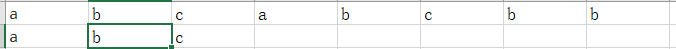

Given a string, find the length of the **longest substring** without repeating characters.

**Examples:**

Given `"abcabcbb"`, the answer is `"abc"`, which the length is 3.

Given `"bbbbb"`, the answer is `"b"`, with the length of 1.

Given `"pwwkew"`, the answer is `"wke"`, with the length of 3. Note that the answer must be a **substring**, `"pwke"` is a *subsequence* and not a substring.

最长不重复子串

## Brute Force

有一个判断当前字符串为不重复的函数 `boolean allUnique(String substring)` .

然后两重循环求解，时间复杂度$O(n^3)$

## sliding window

在暴力搜索中， `boolean allUnique(String substring)` 对于字串是从头开始搜索的。如果使用`set`的结构，可以将复杂度降到$O(n^2)$

## Sliding Window Optimized

暴力搜索会产生很多不必要的操作，比如$s_{i,j}​$代表字符串 $i​$ 到 $j-1​$ 没有重复字串。则我们只需要判断第 $j​$ 个是否含于 $s_{i, j}​$ 即可。如果不包含，则 $s_{i,j}​$ 变为 $s_{i,j+1}​$ 。如果包含，则从包含的下标的下一位置开始(记录对应的位置)。

如下图所示：



下一坐标起始点即为2

这样就把时间复杂度降到了$O(n)$

```python
  def lengthOfLongestSubstring(self, s):
    """
    :type s: str
    :rtype: int
    """
    used = {}
    max_length = start = 0
    for i, c in enumerate(s):
      if c in used and start <= used[c]:
        start = used[c] + 1
      else:   
        max_length = max(max_length, i - start + 1)
            
      used[c] = i
    
    return max_length
```

## 