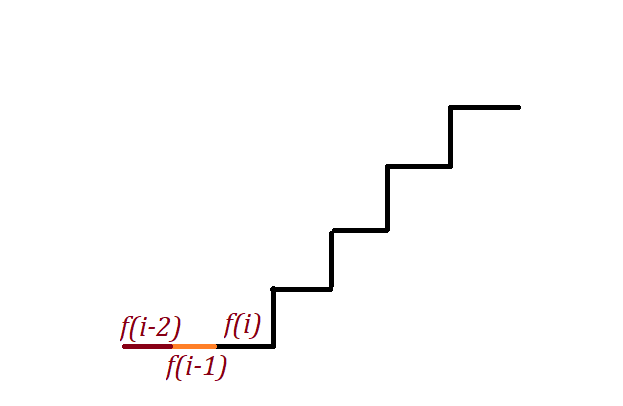

最小代价爬楼梯：

每爬一层楼梯需要支付一定的代价，支付以后可以选择爬一层或者两层。那个找到最小代价。

**Example :**

```
Input: cost = [1, 100, 1, 1, 1, 100, 1, 1, 100, 1]
Output: 6
Explanation: Cheapest is start on cost[0], and only step on 1s, skipping cost[3].
```

**Note:**

1. `cost` will have a length in the range `[2, 1000]`.
2. Every `cost[i]` will be an integer in the range `[0, 999]`.

## solution

典型的动态规划的题目。

最终的cost为 `f[i] = cost[i] + min(f[i-1],f[i-2])` 即当前的cost是当前加上前面最小的cost。




所以只要记录前面两步的cost即可。开始的时候认为这个是0.

```python
def minCostClimbingStairs(cost):
        f1 = f2 = 0
        for x in cost:
            f1, f2 = x + min(f1, f2), f1
        return min(f1, f2)
```